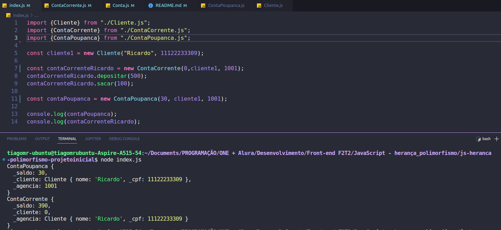

# Curso de JavaScript: interfaces e Herança em Orientação a Objetos

Faça esse curso de JavaScript e:

- Aprofunde seus conhecimentos em Orientação a objetos

- Saiba o que é o "DuckType"

- Entenda quando e como usar herança dentro de seus projetos

- Conheça boas práticas de programação

- Veja código JavaScript moderno que você pode utilizar em seus projetos 

### 01. Conhecendo o problema do cliente

O que aprendemos nessa aula:

- Relembramos conceitos de classe, Propriedades,

- Boas práticas na hora de declarar atributos

- Declarando sempre as propriedades como sendo privadas inicialmente

- Problemas de duplicação de código

- Problemas de código extremamente compartilhado

### 02. Herança 

O que aprendemos nessa aula:

- Especializando código

- Herdando propriedades e atributos

- Sobrecarga de métodos

- Compartilhando código de forma segura

- Mantendo nosso código na linguagem do cliente

- Evitando código muito complicado através da herança

- Palavra-chave Super

- Método e propriedades privadas e protegidas

### 03. Classes abstratas

O que aprendemos nessa aula:

- Como o JS sabe quem está sendo instanciado.

- Pensando na proteção do nosso sistema

- Lançando erros para o sistema

- Classes abstratas

- Métodos abstratos

- Erros em tempo de execução

### 04. Sistema interno 